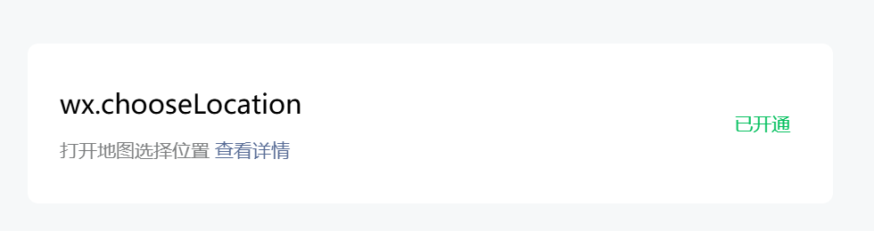
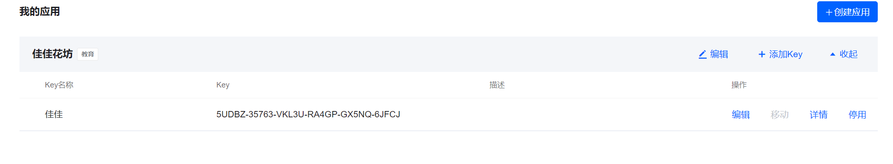
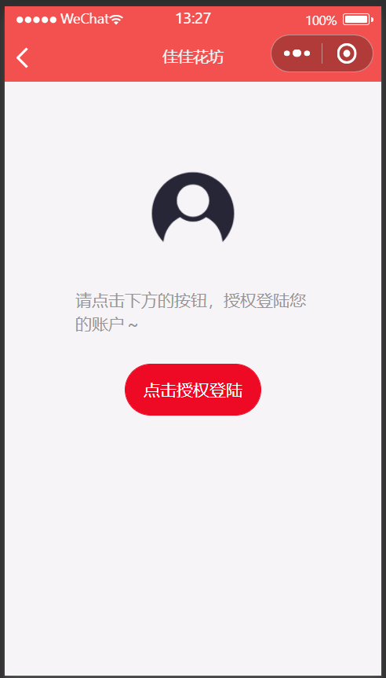
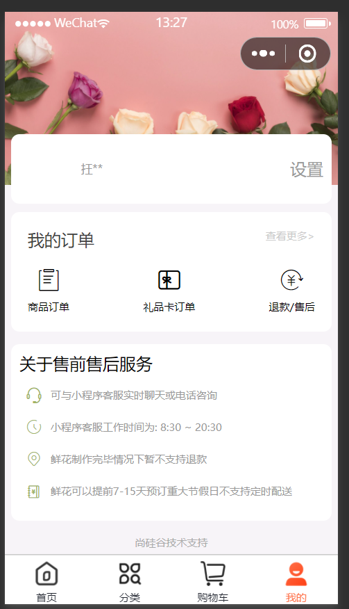
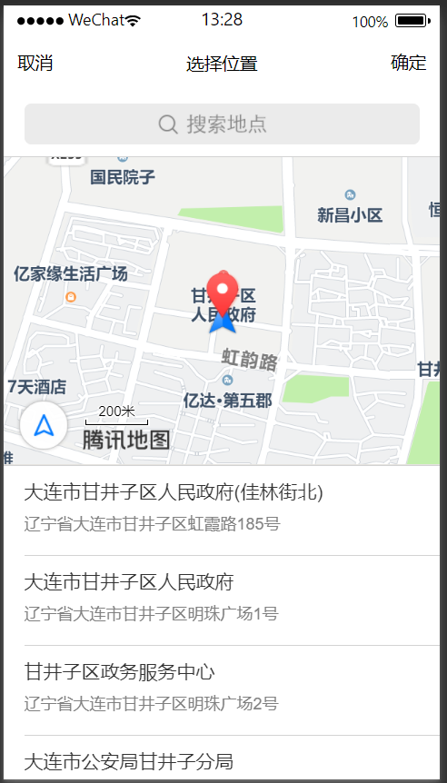
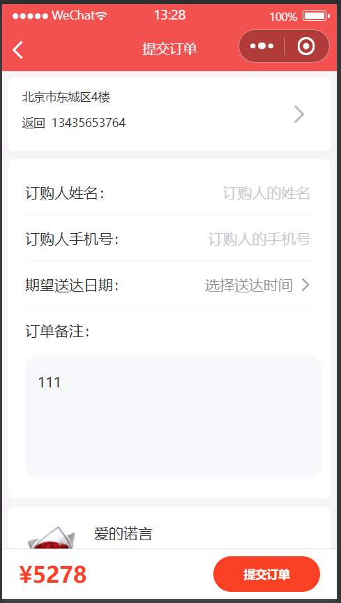
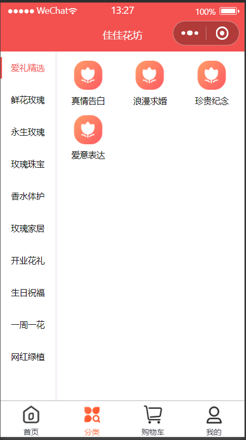

# 微信小程序慕尚花坊

## 项目概述

该项目基于微信小程序开发和现在小程序火爆的实际生活体验和实际需求所做的。该小程序旨在学习微信小程序开发使用，并不能实际体检支付功能，但该项目基本完成了微信小程序的许多基本功能，例如用户登录，购物车，地址定位，订单备注等功能。小程序使用基于Javascript语法框架。 

## API文档

[node_modules ](https://github.com/node-modules)

```
npm init -y  /*生成package.json文件*/   
npm install  /*安装模板*/
```


## 腾讯为地址服务

<div style="text-align:center">1.微信公众平台-->开发-->开发管理</div>


<div style="text-align:center">2.申请wx.chooseLocation地址获取权限</div>



<div style="text-align:center">3.开通腾讯为地址服务-->控制台</div>


<div style="text-align:center">4.（中间需要自己去按步骤申请自己密钥和需要开发的微信公众平台账号）添加项目</div>



<div style="text-align:center">5.寻找需要的功能进行名额分配</div>


## 效果浏览

<div style="text-align:center">首页展示：</div>

  

<div style="text-align:center">登陆展示：</div>



<div style="text-align:center">我的页面展示： </div>



<div style="text-align:center">地址服务展示：</div>



<div style="text-align:center">订单备注展示：</div>



<div style="text-align:center">分类展示：</div>




